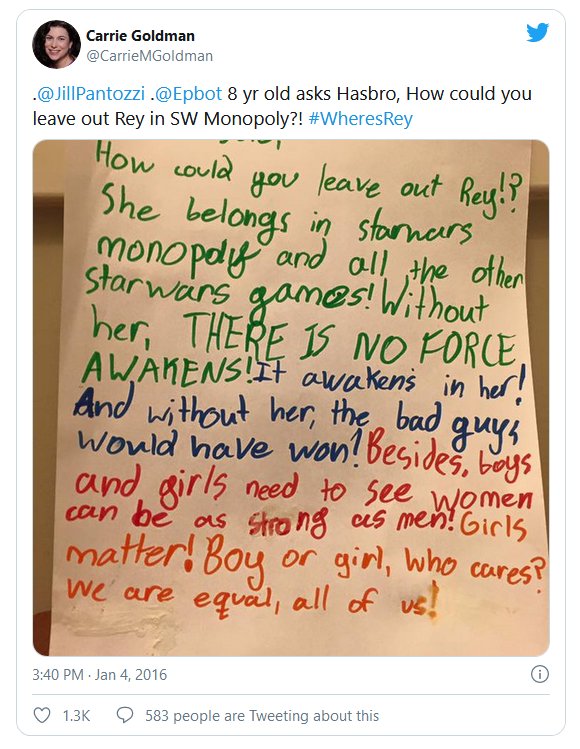
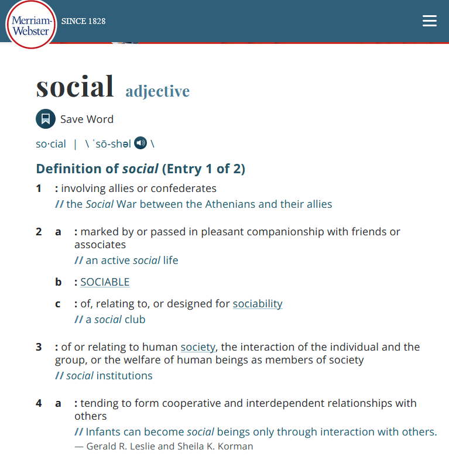

# Introduction

## The Star Wars Franchise and #WhereIsRey?

## People Noticed...

::::::{.columns}
:::{.column}

:::
:::{.column}

:::
::::::

## ... and a Tweetstorm followed

## Some fans were more influential than others

## Why Do We About Care Social Media Analytics?

+ Social Media can be a "listening post"

  - Disney defines it as "customer-centric tools companies use to assess the customer experience and identify areas where customer needs are not being met."
  - Social data is big, changes fast, and may be multi-dimensional or unstructured, therefore we need data tools.
  
+ Social Media Analysis can also identify influential nodes:

  - Nodes that are highly related and/or highly interactive.
  - Lower cost of engaging with a single / a few social actors.
  
+ We can learn techniques that are useful in domains outside Social Media:

  - Social Network Analysis: used in fraud analytics, Anti-Money Laundering, Network Analysis, Entity Relationship Analysis, etc.
  - Text Analysis: automated extraction and summarization of information

## A (Partial) Map of the Internet

)](./img/network_map_wiki.jpg)

## Defining "Social"

Three key elements:

+ Profiles
+ Interaction
+ Relationships

## Profiles

+ Describe people, organizations, and other social entities.
+ Contain structured and unstructured data:

  - Structured data: 
    * It is of a predictable type (number, character, date, etc) and structure.
    * Can be easily organized in tables or groups of tables. 
    * Examples: name, location, gender, date of birth, etc.
  - Unstructured data: 
    * Variable form.
    * Cannot be easily organized. 
    * Example: an opinion about an event or object written in English, a picture of a puppy, an audio recording of an interview, etc.

## Sample Profiles: Journalists covering Social Media

## Interactions

+ The nature and content of people's communications or actions.
+ Interactions can be: 

  - Transactions: buy/sell, agree through a contract
  - Communications: press releases from a company, articles about a company, social media posts by an individual
  - Behaviours caught on film
  
## An Interaction

## Relationships

+ Two types of relationships:

  - Standing or long-term relationships:
    * Exist by virtue of membership in a family or other social group.
    * They can be manifested by connections on LinkedIn, followers on Twitter, or friends on Facebook.
  - Ad hoc relationships: 
    * Exist around interactions.
    * Replying, reposting or linking to a post.
    
+ Relationships give rise to **social orderings** such as groups, status, and hierarchy.

## Relationships (cont.)

+ The analysis of relationships can provide actionable insights.

  - Who is the most connected node in the network that can retransmit a message more easily? 
  - How much is an influencer's message worth?
  - Who is disseminating fake news items?

+ Relationships may also exist between people and other social artifacts:

  - Location
  - Events
  - Technologies
  
## A Network Map

## Social Data

+ The five *Vs* of Big Data
  - *Volume*: huge amounts of data
  - *Velocity*: the speed of accumulation of data is high or, equivalently, data is produced very fast
  - *Variety*: the nature of data can be structured or unstructured, it can involve different types of data (numbers, text, dates, pictures, links, etc.)
  - *Veracity*: inconsistencies and uncertainty in data, as data can be messy and quality/accuracy are difficult to control
  - *Value* can be obtained from Big Data, but value has to be extracted and is not readily available
  
+ Social Data will generally be Big Data

## Analytics

Analytics may refer to a process and a product:

+ A *process* that is the systematic computational analysis of data
+ The resulting *product* of such analysis, which is informative and insightful 

## A Systematic Process

### Data analysis generally includes the following *iterative* steps:

+ Gathering data:
  
  - Manually
  - Harvested from Application Programming Interfaces (APIs) or through scraping
  
+ Cleaning and preparing data:

  - Data validation
  - Data structures
  
+ Analysis:

  - An iterative process
  - May result in more questions

## An Informative and Insightful Product

+ Provides value to the users: a person, an organization, or society
+ Tell a coherent story or make a solid argument
+ Use visual representations of complex relationships
+ It should add value:

  - Support and legitimize a strategic direction or maneuver
  - Help craft new tactics
  
## Skills of a Social Media Data Analyst (team)

+ Domain knowledge and problem identification: helps determine what is meaningful from what is not. One needs to understand the problem, business, audience, etc.
+ Pattern recognition: we need to identify patterns that generalize well to data we have not yet seen
+ Quantitative skills: statistics, time-series analysis, graph theory, etc.
+ Technical skills: manipulation and preparation of structured and unstructured data, Big Data, etc.
+ Visualization: not trivial and requires good design skills
+ Curiosity and problem solving

## Listening to Key Stakeholders

+ Detect problems
  - Identify problems as they emerge and take corrective action at early stage
+ Understand sentiment
  - Understand stakeholders' messages as they convey emotions
+ Identify emotional hotspots
  - Combination of strong sentiment and centrality (influence) within a social network
+ Help determine where to listen
  - Optimize the use of organization's resources

## SMA for Understanding Social Groups

+ Visualize configurations of social ties
+ Identify influential actors
+ Ascertain group fault lines

## SMA for Benchmarking Organizational Strategies

User make critical decisions on 

+ Friending: who becomes your friend
  * Exposure to information shared by their friends within their own news feeds
  * Inferences made from whom you friend with (symbolic consequences)
+ Reciprocate friending
+ What to post

## SMA for Managing Conflicts

+ Determine whether a social group is polarized
+ Represent competing parties' semantic networks