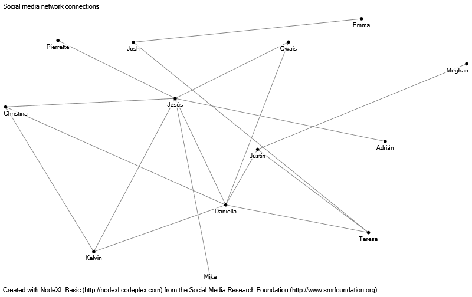
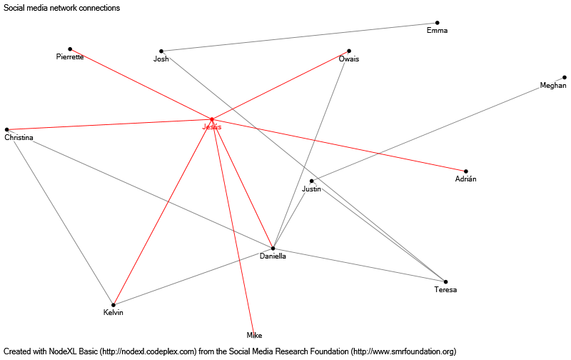
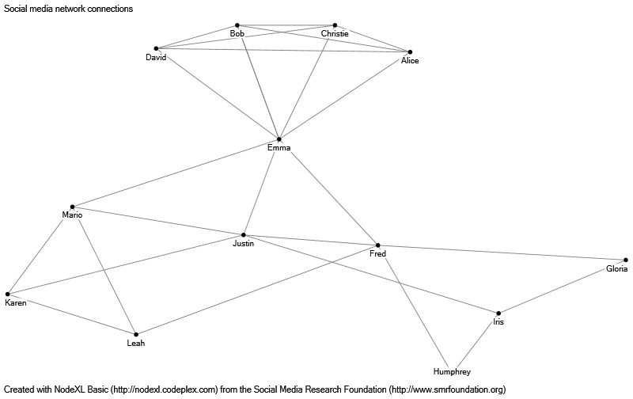
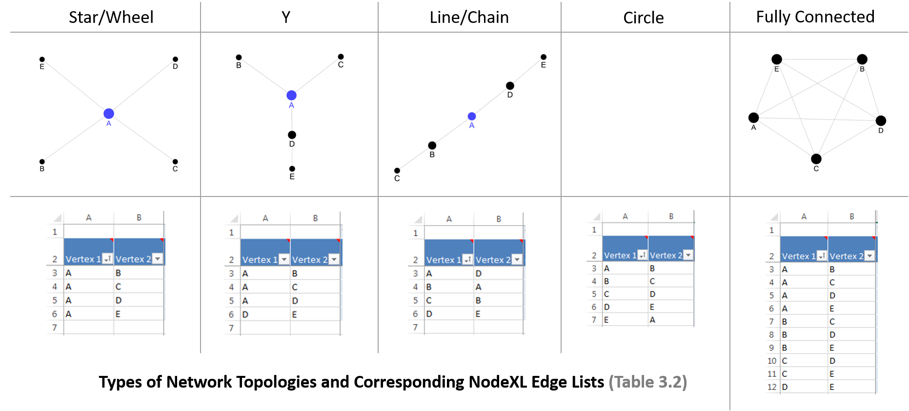
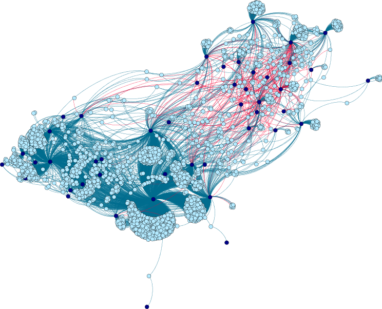
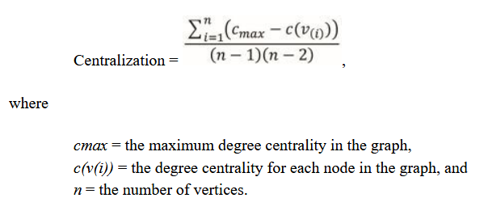

# Social Network Analysis

## The Origins of SNA

+ Methods for studying social networks were first developed by Georg Simmel, a sociologist
+ Sociometry: 
  - Developed in the 1930s by Jacob Moreno and Helen Jennings
  - Study of social network phenomena
  - Preference-based social structures 
  - Structures can be shown in sociograms or social network diagrams 
  - Founded journal *Sociometry* in 1937

](./img/moreno1.png)

## Surveillance in GDR

 social network (Miranda, 2019)](./img/stasi.jpg)

+ Social network diagram believed to be produced based on [Stasi surveillence](https://en.wikipedia.org/wiki/Stasi).
+ [Julia Argwin](https://en.wikipedia.org/wiki/Julia_Angwin): modern-day surveillance (by governments, corporations, and individuals) is a high/tech version of Stasi surveillance and SNA.

## The Small World Experiments and Kevin Bacon

+ Small World Experiments
  - Conducted by Stanley Milgram in 1960s
  - Select two random individuals and send an object (a folder) from one to the other
  - Object to be passed from acquaintance to acquaintance
  - Track people involved
  - Number of intermediaries used to connect source to target ranged from two to ten, and averaged six

)](./img/kevin_bacon.png)

## High-Impact Applications

+ AIDS patient contact tracing 
  - During late 1970s and early 1980s used by CDC
  - Used to identify patient zero in North America, an Air Canada flight attendant
  - Limits of SNA: further analysis indicated that other patients contracted AIDS virus earlier.

+ Sociometry borrowed tools from graph theory and matrix algebra
+ During the 1990s, software tools for SNA appear

## SNA Terminology: Nodes

+ **Node** 
  - A discrete actor (e.g., person, organization, group, etc.) or entity (e.g., place, object, event, or concept).
  - Also called *vertex*
+ **Ego**
  - A focal node 
  - A node of particular interest 

+ **Alter**
  - Nodes surrounding the *ego*
  

## Networks

+ **Complete network**
  - Entire network of a particular social space
+ **Ego network**
  - Nodes surrounding the focal ego 

## Ties

+ **Tie**
  - A link between nodes
  - Also called *Edge*
+ **Reciprocity**
  - Reciprocated: mutual
  - Unreciprocated: not returned
+ **Strength**
  - Strong tie: positive affect, repetitive engagements, multiplexity
  - Weak tie: among acquaintances, has informational advantages

+ **Cardinality of nodes**
  - Dyad: relationship between two nodes
  - Triad: relationship among three nodes
+ **Position**
  - Central: pass-through node for most ties
  - Peripheral: outlying nodes in a network

## Components

+ **Component**
  - A node or collection of nodes
  - Separated from rest of a network
  - Can be a node, dyad, triad, or more complex network
+ **Information brokers**
  - An individual that connects otherwise disconnected components
  - All otherwise disconnected components are internal to the organization
+ **Boundary spanner**
  - Connects otherwise disconnected components, but some of the components are external to the organization

## Weak Ties in a Network

+ *Information brokers* and *boundary spanners*
  - Tend to be weak ties
  - They are useful for disseminating information across components

## Why Do Networks Form?

+ Propinquity
  - Physical proximity
+ Homophily
  - Demographic or other forms of similarity
  
+ Transitivity
  - Tendency for ties to achieve balance and avoid dissonance
  - Gives rise to *network closure* (fully connected network)

## Types of Social Networks

+ **Directed network**

  - Can have, both, reciprocated and unreciprocated ties
  - Examples: Twitter, favs, payments, email
  - Reciprocated ties are shown as ties with bi-directional arrows
  - Unreciprocated ties are shown with single direction arrows

+ **Undirected network**

  - All ties are reciprocated
  - Examples: LinkedIn, Facebook, co-authors, members of board of directors

)](./img/datamodel.jpg)

## Types of Networks

+ **One-Mode Network**

  - All nodes are entities of same type
  
+ **Two-Mode Network**

  - Nodes are entities of different types

](./img/two_mode.png)

## Visualizing Social Networks: Network Data

+ Network data needs to be setup in the form that the software package requires it
+ There are two main forms to setup network data:

  - Adjacency matrix
  - Edge list

+ **Adjacency matrix**

  - *n x n matrix*, where *n* is the number of nodes
  - Symmetric matrix if undirected network
  - Generally (but not necessarily), we will see an asymmetric matrix if we have a directed network

+ **Edge list**

  - Lists of connected pairs, i.e., between every pair of nodes there is a tie
  - Order is not important in undirected network
  - Order is fundamental in directed network

## Visualizing Social Networks

## Visualization tools

+ [NodeXL](https://www.smrfoundation.org/nodexl/): an Excel template. Simple, but limited by spreadsheet's limitations
+ [UCINet](https://sites.google.com/site/ucinetsoftware/home): range of metrics and stats
+ [Pajek](http://mrvar.fdv.uni-lj.si/pajek/): analysis and visualization of very large networks
+ [Gephi](https://gephi.org/): powerful visualization tool
+ [R](https://www.r-project.org/): multiple [packages for SNA](https://cran.r-project.org/web/views/gR.html)

## Visualization in Gephi

## Layout Algorithms

+ **Random algorithm**

  - Assigns each node to a random position
  - Tries to avoid collisions / overlapping nodes

+ **Force-directed layout algorithms**

  - Iteratively bring together connected nodes and push apart unconnected nodes
  - Examples: Fruchterman-Reingold and Harel-Koren Fast Multiscale

+ **Tree layout algorithms**

  - Ideal for depicting hierarchical social structures

## Social Network Metrics

+ **Subgraph**
  
  - A subset of a graph that we want to analyze

+ Metrics provide information about the properties of an entire network beyond what we can visualize

## Paths and Components

+ If a path between two nodes exists, we say that one node is **reachable** from the other
+ **Connected component** 

  - A single node that is disconnected from the rest of the network, i.e., an **isolate**
  - Multiple nodes that are connected among themselves, but unreachable from the rest of the network

## Geodesic Distance

+ Geodesic Distance (GeoDist)

  - GeoDist between two nodes: shortest path between two nodes
  - GeoDist distance of a graph: the maximum geodesic distance in the graph

+ GeoDist measures communication efficiency

  - Fewer hops, imply faster and better communication

+ GeoDist also indicates cohesion
  - A larger max or average GeoDist, indicates that the network can be easily fragmented
  
## Density and Modularity

+ **Density**
  
  - Proportion of all possible ties that exist or are realized

+ **Modularity**

  - Measures the extent to which the network contains densely connected modules to the inside, but sparsely connected modules among themselves
  - Modularity depends on the algorithm applied

## Network Centralization

::::::{.columns}
:::{.column}

+ Measures the extent to which information or other resource flows through one node
+ Can be calculated from any of the ego centrality measures
+ Measures centralization as the sum of differences between the maximum centrality value and each individual one scaled by the maximum potential centrality

:::
:::{.column}

:::
::::::

## Clustering coefficient

+ For a graph, it is calculated as the average of clustering coefficient of each node
+ It measures the proportion of cluster members who are tied to each other
+ It captures the cliquishness of a graph

## Ego Metrics: Centrality Metrics and Degree Centrality

+ **Centrality**
  - Measures the prominence of a node
  - A node is prominent because of degree centrality, betweenness centrality or closeness centrality
+ **Degree centrality**
  - The count of an ego's direct connections
  - For directed networks, we can calculate the in-degree centrality and the out-degree centrality
  - Many times, degree centrality is normalized by the total tie count in the network
+ **Eigenvector centrality**
  - A relative measure of degree centrality
  - Adjusts a node's prominence based on the relative prominence of odes to which it is tied
  - Eigenvector centrality attaches prominence to nodes that are undertaking strategic or efficient activity

## Other Centrality Metrics

+ **Betweenness centrality**

  - Measures the number of indirect ties a node mediates
  - Equivalently, measures the number of geodesic paths in which the node acts as a bridge

+ **Closeness centrality**

  - Measures closeness by considering the inverse of the number of hops to each other node
  - More hops mean that the other nodes are farther apart
+ **Clustering coefficient**
  - Proportion of one's ties that are also tied to each other
  - Speaks to the extent to which social structures around the ego are structurally equivalent

+ A **clique** is a fully connected subgroup within a network

